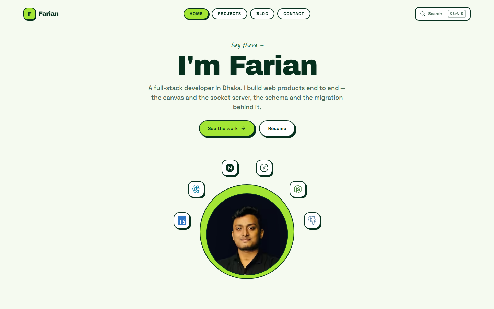
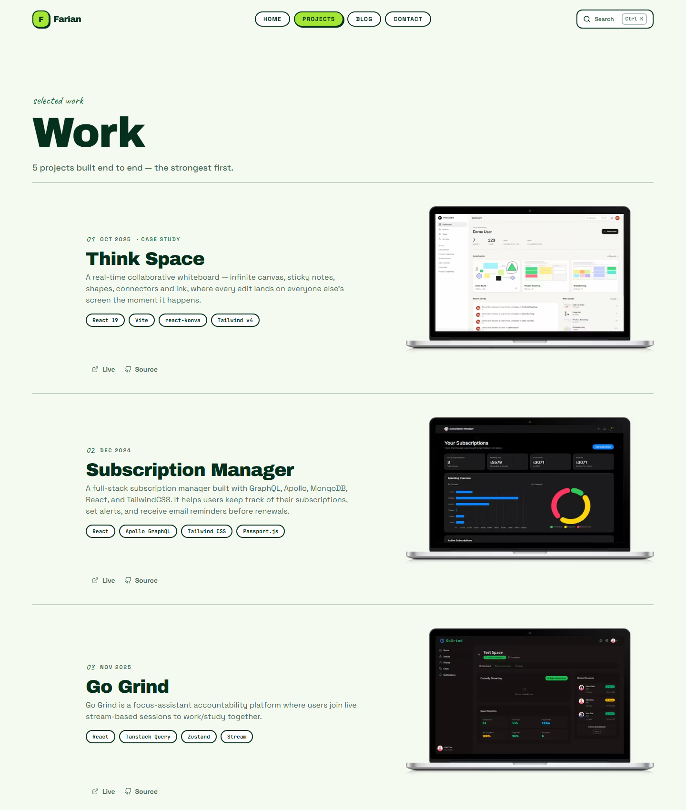
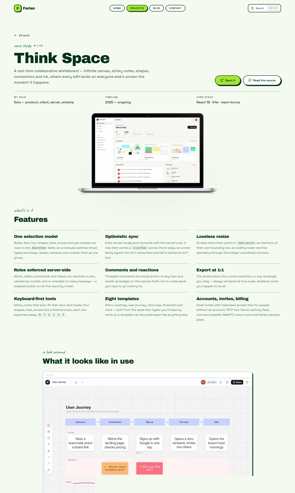
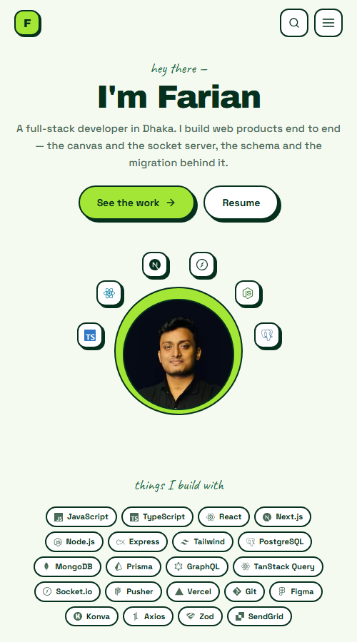

# Farian Bin Rahman — Portfolio

My personal site: a work index, long-form project write-ups, and a small blog.
Built with Next.js 14 (App Router), TypeScript, Tailwind and Contentlayer.

**Live:** [farian.me](https://farian.me)



---

## The design

Neo-brutalist, single theme — flat colour, 2px borders, hard offset shadows with
no blur, and heavy display type. Buttons press into their own shadow instead of
fading a colour, which is what makes the style feel physical rather than
decorative.

The palette lives entirely in CSS variables in [`styles/globals.css`](styles/globals.css),
so the whole site re-skins from one block. Two fill tokens exist on purpose:
`--accent` is whatever is legible as *text*, while `--zing` (lime) and `--pop`
(yellow) are background-only and always carry their own ink colour — use lime for
link text and it fails contrast immediately.

| | |
|---|---|
| **Display** | Archivo Black |
| **Body / UI** | Space Grotesk |
| **Asides** | Caveat |
| **Code** | JetBrains Mono |

## The work index

Projects are ordered by an explicit `order` field rather than by date — the
strongest work leads regardless of when it was built.



## Case studies

Projects marked `caseStudy: true` render a longer template: masthead, a features
grid where every line names its *mechanism*, a captioned screenshot walkthrough,
and the stack. Everything is structured frontmatter, typed in
[`lib/projects.ts`](lib/projects.ts) — the MDX body is only used for projects that
haven't been migrated to the format yet.



## Mobile

Mobile-first throughout: the hero ring scales by percentage so it holds together
without JS, the nav collapses to bordered cards, and the skills chips step down a
size.



## Tech

| | |
|---|---|
| **Framework** | Next.js 14, App Router |
| **Language** | TypeScript |
| **Styling** | Tailwind CSS |
| **Animation** | Framer Motion |
| **Content** | Contentlayer (MDX for projects and posts) |
| **Search** | Fuse.js, behind a `Ctrl/Cmd+K` command palette |
| **Data** | MongoDB via Mongoose, for the visitor counter |
| **Email** | Resend, for the contact form |

## Running it

**Requires:** Node 18+, and a MongoDB connection string if you want the visitor
counter to work.

```bash
git clone https://github.com/farianbr/portfolio.git
cd portfolio
npm install
cp .env.example .env.local   # then fill in the two values below
npm run dev                  # http://localhost:3000
```

```bash
MONGODB_URI=...     # visitor counter; the site runs without it, the count won't
RESEND_API_KEY=...  # contact form; submissions fail without it
```

Deploys to Vercel with no extra configuration — set the same two environment
variables in the project settings.

## Layout

```
app/
  projects/[slug]/   case-study template
  blog/[slug]/       post template
  api/               contact, visitors, github-stats proxy
components/
  projects/          case-study pieces — masthead, features, walkthrough, stack
  sections/          home-page sections
  ui/                command palette, skills grid, reveal-on-scroll
content/
  projects/*.mdx     frontmatter-driven case studies
  blog/*.mdx
lib/projects.ts      types and accessors for the case-study frontmatter
styles/globals.css   the entire palette, plus button/card/chip primitives
```

### Adding a project

Drop an `.mdx` file in `content/projects/`. The fields that drive the case-study
template — `features`, `gallery`, `stack`, `role`, `timeline`, `order` — are
defined in [`contentlayer.config.ts`](contentlayer.config.ts) and typed in
[`lib/projects.ts`](lib/projects.ts). Set `caseStudy: true` to opt into the full
template; without it the page renders the MDX body instead.

---

Built with care.
